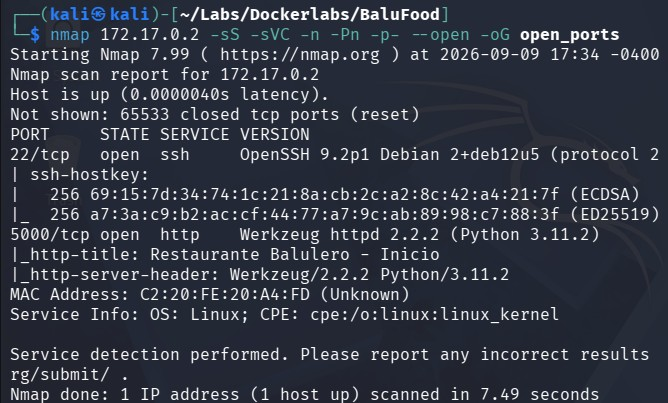
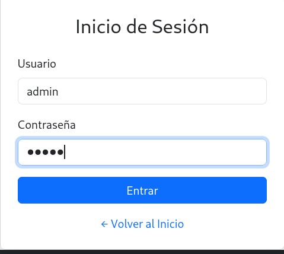
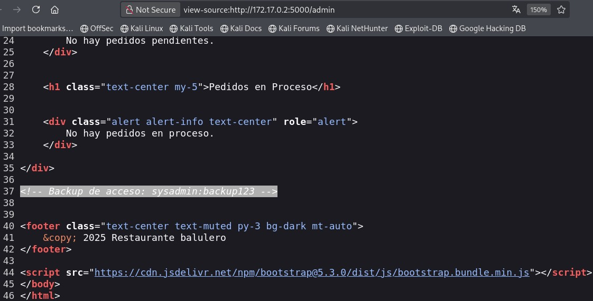
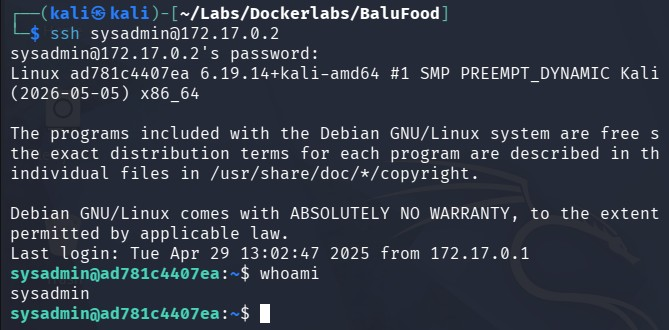
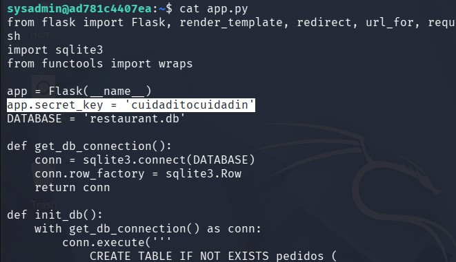
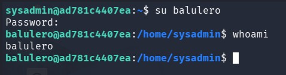
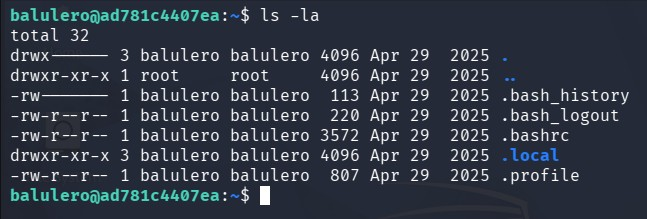
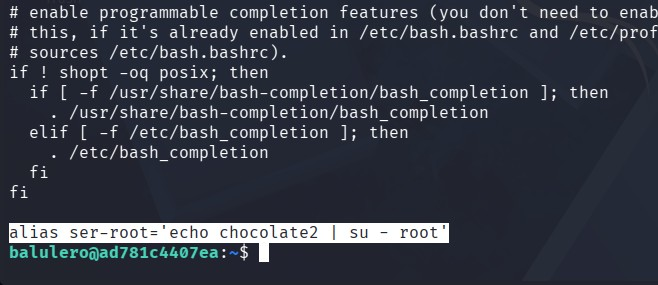
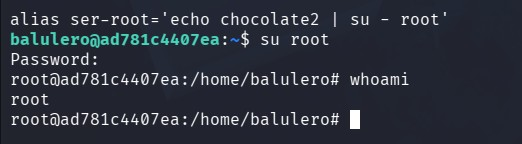

# BaluFood - Writeup

## Resumen 
En esta máquina tendremos que buscar información filtrada del código fuente para lograr acceder al usuario, practicaremos pivoting y subida de privilegios mediante archivos ocultos.

## Paso N1: Reconocimiento 
Empezamos escaneando los puertos tcp de la máquina con sus respectivas versiones y servicios:
```
nmap 172.17.0.2 -sS -sVC -n -Pn -p- --open -oG open_ports
```


Vemos que estan abiertos los puerto 5000 y 22 correspondiente a servicios http y ssh respectivamente.

## Paso N2: Visualización de la página
Entramos a la página con el siguiente enlace ```http://172.17.0.2:5000```, le especificamos que queremos entrar en el puerto 5000, pues ahí es donde está la página web, de no especificar el puerto, la página no cargaria.

Una vez investigada la pagina, llegariamos a la página de login ```http://172.17.0.2:5000/login```.
Cómo no tenemos información de que credenciales usar, podremos usar credenciales básicas como lo seria ```admin:admin```
y lograremos entrar


## Paso N3: Obtención de credenciales
Si vemos el código fuente de la página, veremos las credenciales del ssh
```
<!-- Backup de acceso: sysadmin:backup123 -->
```


accedemos al servidor ssh con las credenciales obtenidas


## Paso N4: Pivoting
En el directorios ```/home/``` veremos ```balulero``` y ```sysadmin```, dandonos informacion de que existe el usuario balulero.

En el directorio de sysadmin, hay un archivo llamado ```app.py``` el cual si le hacemos un cat, veremos la siguiente información
```
app.secret_key = 'cuidaditocuidadin'
```


Intentamos entrar al usuario ```balulero``` con esta contraseña y logramos acceder


## Paso N5: Escalada de privilegios
Al intentar la extracción de información de subida de privilegios con ```sudo -l``` u obtenciòn de binarios SUID vulnerables con ```find / -perm -4000 2>/dev/null``` no encontraremos información relevante.

Viendo los archivos ocultos de nuestro directorio default encontraremos ```.bashrc```


El cual al hacerle un ```cat``` encontraremos información relevante:
```
alias ser-root='echo chocolate2 | su - root'
```


Así que accediento a root con las credenciales obtenidas, finalmente subimos de privilegios.

