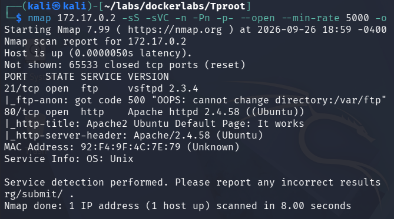
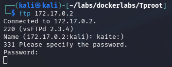
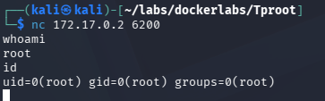

# Tproot - Writeup

## Resumen
Explotación de la vulnerabilidad vsftpd 2.3.4 

## Paso N1: Reconocimiento
Empezaremos escaneando los puertos TCP abiertos de la maquina victima con sus respectivos servicios y versiones
```
nmap 172.17.0.2 -sS -sVC -n -Pn -p- --open --min-rate 5000 -oG open_ports
```


Podemos ver en pantalla que están abiertos los puertos 21 y 80 correspondientes a ftp y http respectivamente. Podemos ver que el servidor ftp está usando ```vsftpd 2.3.4```, una versión un poco antigua que tiene cierta vulnerabilidad.

## Paso N2: Intrusion medianto vsftpd 2.3.4
Investigando un poco, podemos concluir que para explotar el `vsftpd 2.3.4` tenemos que poner una carita feliz `:)` en el nombre, una vez ingresada las credenciales, a pesar de ser incorrectas se abrirá el puerto 6200. Para esta máquina usaré el usuario `kaite:)`


Sin salirnos, entramos al puerto 6200 desde otra terminal con `nc 172.17.0.2 6200` y habremos entrado al sistema como usuarios root.




